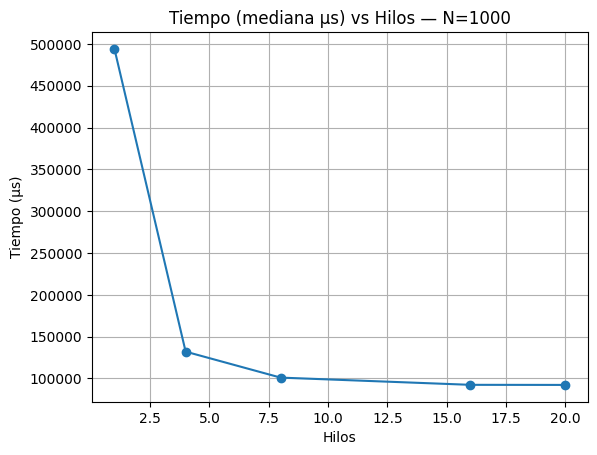
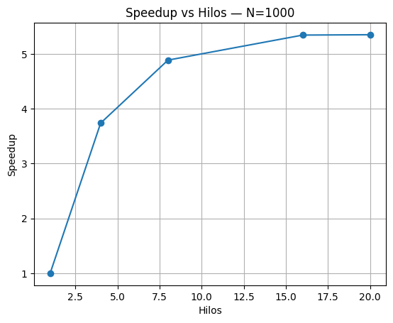
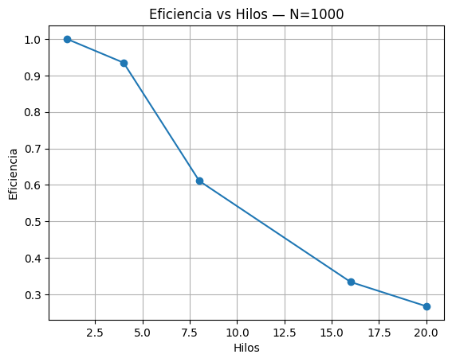
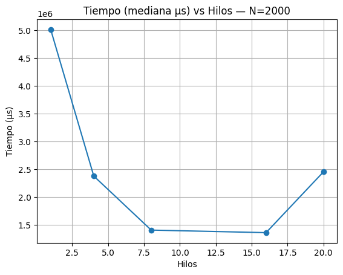
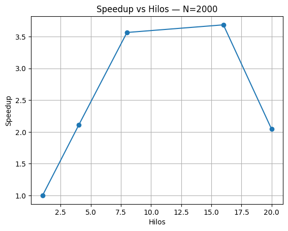
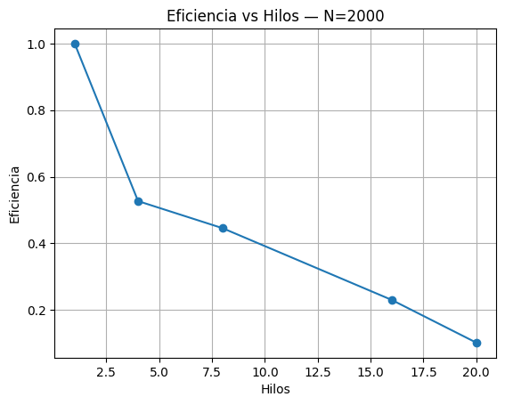
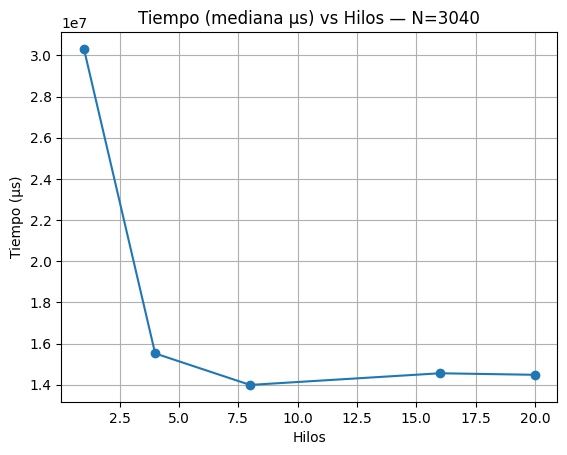
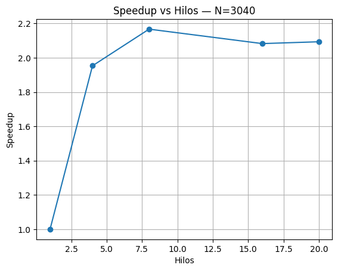
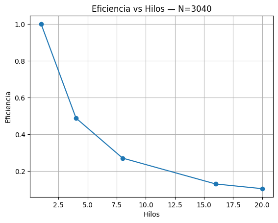

# Taller 1 — Multiplicación de Matrices con OpenMP
**Autor:** Juan Sebastián Vargas Cortes  
**Fecha:** (hoy)

## 1. Objetivo
Evaluar el rendimiento del algoritmo clásico de multiplicación de matrices (MM) con paralelismo OpenMP, variando el tamaño N y el número de hilos.

## 2. Plataforma de pruebas
- Equipo: (modelo Mac, núcleos/hilos)
- RAM: (GB)
- SO: (versión)
- Compilador: gcc-15 (Homebrew)
- Flags: `-O3 -march=native -fopenmp -Wall -Wextra`
- Variables OMP (opcional): `OMP_PROC_BIND=close`, `OMP_PLACES=cores`

## 3. Diseño experimental
- Factores: **N** ∈ {1000 … (máximo que corriste)}; **Hilos** ∈ {1,4,8,16,20}.
- Repeticiones: 7 por combinación.
- Métrica: tiempo en µs de **solo** la multiplicación (medido con `gettimeofday`).
- Control de ruido: cerrar apps y ejecutar en condiciones similares.

## 4. Implementación
- OpenMP con `#pragma omp parallel` y `#pragma omp for schedule(static)`.
- Variables internas (`Suma`, `pA`, `pB`) privadas por hilo para evitar data races.
- Impresión de matrices solo para `N < 9` (depuración).

## 5. Resultados
Se generó `estadisticas.csv` con: media, mediana, std, speedup y eficiencia.  
A continuación, ejemplos representativos (N pequeño, medio y mayor):

**N=1000**  
  
  


**N=2000**  
  
  


**N=3040**  
  
  


## 6. Análisis (resumen con tus números)
- N=1000: speedup ≈ **5.35×** con 20 hilos; eficiencia ≈ **0.27** → el problema es pequeño y el overhead cuenta.
- N=2000: mejor alrededor de **16 hilos** (speedup ≈ **3.69×**); con **20 hilos** cae a ≈ **2.04×** por ancho de banda/afinidad.
- N=3040: speedup ~**2.17×** a 8 hilos y ~**2.08×** a 16 hilos → se evidencia cuello de botella de memoria.

## 7. Conclusiones
- OpenMP acelera la MM para tamaños medianos/grandes.  
- La eficiencia decrece al aumentar hilos; en esta máquina, el mejor T práctico está alrededor de (tu observación).  
- El límite lo marca el ancho de banda de memoria y la RAM disponible para N grandes.

## 8. Reproducibilidad
```bash
make
make run
python3 stats.py
python3 plot.py


